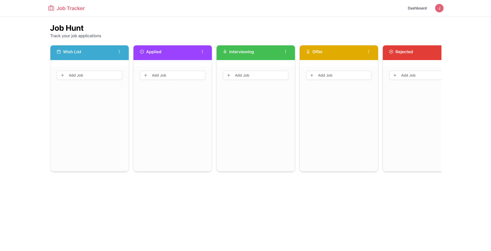
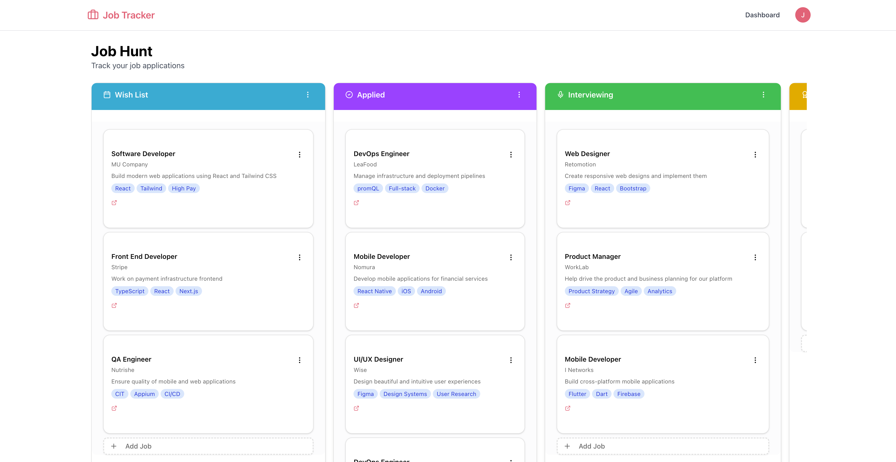
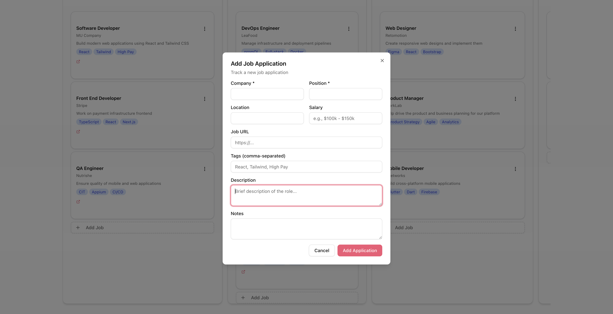

# Job Application Tracker

A customizable job application tracking dashboard built with Next.js, TypeScript, MongoDB, and Tailwind CSS. This project helps users organize their job search by creating custom columns, adding job application cards, and dragging applications between different stages of the hiring process.

## Live Demo

https://jobapplicationtracker-bay.vercel.app/

## Overview

The Job Application Tracker is a web app designed to make the job search process easier to manage. Instead of tracking applications across notes, spreadsheets, or scattered documents, users can organize opportunities visually in a board-style dashboard.

Users can create their own workflow columns, customize column colors, add job application cards, and move cards between stages as their applications progress. The project was inspired by a tutorial from PedroTech, but expanded with additional custom functionality such as custom column creation, column color selection, and icon picking.

## Features

- Create custom job application cards
- Create custom dashboard columns
- Drag job cards from column to column
- Customize column colors with a hex color picker
- Choose icons for custom columns
- Organize applications by status, company, or personal workflow
- Store application data using MongoDB and Mongoose
- User authentication with Better Auth
- Responsive UI built with Tailwind CSS and shadcn/ui

## Tech Stack

- **Framework:** Next.js
- **Language:** TypeScript
- **Database:** MongoDB
- **ODM:** Mongoose
- **Authentication:** Better Auth
- **Styling:** Tailwind CSS
- **UI Components:** shadcn/ui
- **Color Picker:** HexColorPicker
- **Drag and Drop:** Draggable React

## Screenshots

Example:

```md



```

## Getting Started

Follow these steps to run the project locally.

### Prerequisites

Make sure you have the following installed:

- Node.js
- npm
- Git
- A MongoDB Atlas account or local MongoDB database

### Installation

Clone the repository:

```bash
git clone your-repository-url
```

Navigate into the project folder:

```bash
cd job-application-tracker
```

Install dependencies:

```bash
npm install
```

### Environment Variables

Create a `.env` file in the root of your project.

Add the required environment variables for Better Auth and MongoDB/Mongoose.

```env
MONGODB_URI=your_mongodb_connection_string
BETTER_AUTH_SECRET=your_auth_secret
BETTER_AUTH_URL=http://localhost:3000
NEXT_PUBLIC_APP_URL=http://localhost:3000
```

Your MongoDB connection string can be created through a MongoDB Atlas cluster. Make sure your database user, password, and network access settings are configured correctly.

### Run Locally

Start the development server:

```bash
npm run dev
```

Open the app in your browser:

```bash
http://localhost:3000
```

## Project Inspiration

This project was inspired and influenced by PedroTech's tutorial:

[Build and Deploy A Production Ready Job Application Tracker w/ MongoDB](https://www.youtube.com/watch?v=vCIsrOGNhas)

While the tutorial provided the initial inspiration, this version expands on the original concept with additional customization features, including:

- Custom column creation
- Column color customization
- Icon picker functionality
- A more personalized job application workflow

## What I Learned

While building this project, I gained more experience working with a modern full-stack web development workflow. I practiced connecting a Next.js app to MongoDB using Mongoose, implementing authentication with Better Auth, creating reusable UI components, and managing interactive drag-and-drop behavior.

I also learned how to take an existing tutorial concept and extend it with my own features, making the final project more personalized and useful for a real-world job search workflow.

## Future Improvements

- Add draggable columns so users can reorder their workflow
- Add dark and light mode support
- Improve dashboard customization options
- Add filtering and search for job applications
- Add due dates or reminders for follow-ups
- Add analytics for tracking application progress

## Author

**Michael Mount**

- Portfolio: https://bit.ly/3HdEJyc
- GitHub: https://bit.ly/mmGithub
- LinkedIn: https://www.linkedin.com/in/mmount98/
